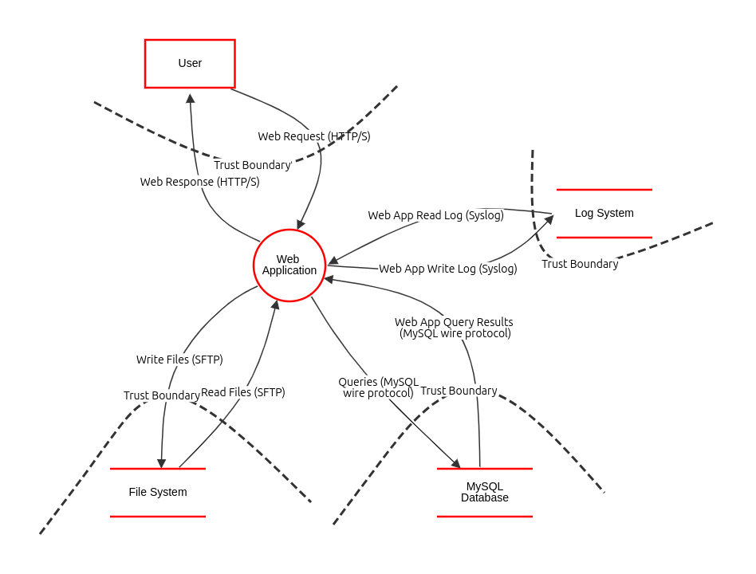

# Fase 1

## Application Description

This document is used for planning and documenting the ShopTex application.
ShopTex is an E-Commerce platform, consisting of multiple stores. Each store controls it own products, but never accesses any user data or info.

## Requirements
The functional and non-functional requirements are defined in the document linked bellow.

[Requirements Document](Requirements.md)

## Logic Diagram

## Domain Model

## Use Case
This section lists the Use Cases and the Use Case Diagram for the system/application.

[Link to Use Cases](useCases.md)

[Link to Use Case Diagram](usecaseDiagram.puml)

## Security
[Link to Security](Security.md)

## Deployment Diagram

The server for the ShopTex will use Fedora 38 and for the requests it will use HTTPS.
The MySQL database will be connected by MySQL wire protocol and the Log database by Syslog over TLS,
for the connections with the backend, and it won't have open ports open to outside internet. 
These databases will use MySQL version 8.0.

## Threat Model

The Threat Modelling for this application was made using Threat Dragon. 
The following link directs to the report generated from Threat Dragon, which includes
the data flow diagram, threat categorization, threat analysis, threat ranking, and mitigation & countermeasure techniques.

[Threat Model Report](threat_model_report.pdf)

### External Dependencies

| ID | Description                                                                                                                                                                                                                                                 |
|----|-------------------------------------------------------------------------------------------------------------------------------------------------------------------------------------------------------------------------------------------------------------|
| 1  | The MySQL database server will be MySQL version 8.0 and it will run on a linux server. This server will be hardened according to ISEP's hardening standard. This includes the installation of the latest operating system and application security patches. |
| 2  | The Log System will run on a linux server. This server will be hardened according to ISEP's hardening standard. This includes the installation of the latest operating system and application security patches.                                             |
| 3  | The File System will run on a linux server. This server will be hardened according to ISEP's hardening standard. This includes the installation of the latest operating system and application security patches.                                            |
| 4  | The connection between the web server and the MySQL database will be over a private network.                                                                                                                                                                |
| 5  | The connection between the web server and the log system will be over a private network.                                                                                                                                                                    |
| 6  | The connection between the web server and the file system will be over a private network.                                                                                                                                                                   |

### Entry Points

| ID | Name                  | Description                                                  | Trust Level                                                                                                                                 |
|----|-----------------------|--------------------------------------------------------------|---------------------------------------------------------------------------------------------------------------------------------------------|
| 1  | Login                 | `POST /auth/login` – Validate credentials and return JWT     | (1) Anonymous Web User (2) User with Valid Login Credentials (3) User with Invalid Login Credentials (4) Store Admin (5) Store Collaborator |
| 2  | Register              | `POST /auth/register` – Create a new user account            | (1) Anonymous Web User (2) User with Valid Login Credentials (3) User with Invalid Login Credentials (4) Store Admin (5) Store Collaborator |
| 3  | List Users            | `GET /user` – List all users                                 | (4) Store Admin                                                                                                                             |
| 4  | Get User Detail       | `GET /user/{username}` – Get details for a single user       | (4) Store Admin (5) Store Collaborator                                                                                                      |
| 5  | Create User           | `POST /user` – Create a new user                             | (4) Store Admin                                                                                                                             |
| 6  | Update User           | `PATCH /user/{username}` – Update an existing user           | (2) User with Valid Login Credentials (4) Store Admin                                                                                       |
| 7  | Delete User           | `DELETE /user/{username}` – Permanently delete a user        | (2) User with Valid Login Credentials (4) Store Admin                                                                                       |
| 8  | Create Store          | `POST /stores` – Create a new store                          | (4) Store Admin                                                                                                                             |
| 9  | Update Store          | `PATCH /stores/{storeId}` – Update an existing store         | (4) Store Admin                                                                                                                             |
| 10 | Delete Store          | `DELETE /stores/{storeId}` – Remove a store                  | (4) Store Admin                                                                                                                             |
| 11 | List Products         | `GET /product` – List products (with query parameters)       | (1) Anonymous Web User (2) User with Valid Login Credentials (4) Store Admin (5) Store Collaborator                                         |
| 12 | Get Product Detail    | `GET /product/{productId}` – Get product by ID               | (1) Anonymous Web User (2) User with Valid Login Credentials (4) Store Admin (5) Store Collaborator                                         |
| 13 | Create Product        | `POST /product` – Create a new product                       | (4) Store Admin                                                                                                                             |
| 14 | Update Product        | `PATCH /product/{productId}` – Update an existing product    | (4) Store Admin                                                                                                                             |
| 15 | Delete Product        | `DELETE /product/{productId}` – Delete a product             | (4) Store Admin                                                                                                                             |
| 16 | Create Discount       | `POST /discounts` – Create a new discount                    | (4) Store Admin                                                                                                                             |
| 17 | Update Discount       | `PUT/PATCH /discounts/{discountId}` – Update a discount      | (4) Store Admin                                                                                                                             |
| 18 | Delete Discount       | `DELETE /discounts/{discountId}` – Remove a discount         | (4) Store Admin                                                                                                                             |
| 19 | Get Cart              | `GET /cart` – Get items in the authenticated user’s cart     | (2) User with Valid Login Credentials                                                                                                       |
| 20 | Upsert Cart Item      | `POST /cart` – Add or update an item in the cart             | (2) User with Valid Login Credentials                                                                                                       |
| 21 | Remove Cart Item      | `DELETE /cart/{productId}` – Remove an item from cart        | (2) User with Valid Login Credentials                                                                                                       |
| 22 | List Orders           | `GET /order` – List authenticated user’s orders              | (2) User with Valid Login Credentials                                                                                                       |
| 23 | Get Order Detail      | `GET /order/{orderId}` – Get order by ID                     | (2) User with Valid Login Credentials                                                                                                       |
| 24 | Create Order          | `POST /order` – Create an order from current cart            | (2) User with Valid Login Credentials                                                                                                       |
| 25 | Update Order Status   | `PATCH /order/{orderId}` – Update order status               | (2) User with Valid Login Credentials (4) Store Admin (5) Store Collaborator                                                                |
| 26 | Cancel Order          | `DELETE /order/{orderId}` – Cancel or remove an order        | (2) User with Valid Login Credentials                                                                                                       |
| 27 | List Payment Methods  | `GET /payments-methods` – List user’s payment methods        | (2) User with Valid Login Credentials                                                                                                       |
| 28 | Get Payment Detail    | `GET /payment/{paymentId}` – Get payment by ID               | (2) User with Valid Login Credentials                                                                                                       |
| 29 | Process Payment       | `POST /payments` – Process a payment via gateway             | (2) User with Valid Login Credentials                                                                                                       |
| 30 | Add Payment Method    | `POST /payment-methods` – Add a new payment method           | (2) User with Valid Login Credentials                                                                                                       |
| 31 | Remove Payment Method | `DELETE /payment-methods/{methodId}` – Remove payment method | (2) User with Valid Login Credentials                                                                                                       |
| 32 | Send Notification     | `POST /notifications` – Send notification to a user          | (4) Store Admin (5) Store Collaborator                                                                                                      |

For a more detailed explanation of the entry points:
[Entry Points](entrypoints.md)

### Assets
This section presents all assets of the application, both physical and virtual (data).
The Confidentiality, Integrity and Availability (CIA) parameters are defined either Low, Medium or High, applied as defined in [CIA Definition](#cia-definitions)

#### Assets Table
| ID      | Name          | Description                                                                       | Trust Levels                                                                                        | Confidentiality                | Integrity  | Availability | Total/Priority | 
|---------|---------------|-----------------------------------------------------------------------------------|-----------------------------------------------------------------------------------------------------|--------------------------------|------------|--------------|----------------|
| SRV-001 | vs531         | Server hosting the main application                                               | (6) System Administrator                                                                            | 1 - Low (No data stored here)  | 1 - Low    | 3 - High     | 5/9            |
| SRV-002 | vs204         | Server hosting the main database                                                  | (6) System Administrator                                                                            | 3 - High                       | 3 - High   | 3 - High     | 9/9            |
| SRV-003 | vs285         | Server hosting the logging database                                               | (6) System Administrator                                                                            | 2 - Medium                     | 3 - High   | 1 - Low      | 6/9            |
| USRD-00 | User data     | The agglomeration of all user data                                                | (6) System Administrator                                                                            |                                |            |              |                |
| USRD-01 | User Personal | Personal information of the user (Name, Date of Birth, Address, E-mail, ID, Hash) | (2) User with Valid Login Credentials                                                               | 3 - High                       | 2 - Medium | 3 - High     | 8/9            |
| USRD-02 | User Payment  | Payment information of the user (Payment Method, Billing Address, NIF)            | (2) User with Valid Login Credentials (4) Store Admin (5) Store Collaborator                        | 3 - High                       | 2 - Medium | 1 - Low      | 6/9            |
| USRD-03 | User Other    | Other information about the user (Purchase History, Review info, Display name)    | (2) User with Valid Login Credentials (4) Store Admin (5) Store Collaborator                        | 2 - Medium                     | 1 - Low    | 1 - Low      | 4/9            |
| PRDD-00 | Product Data  | The agglomeration of all product data                                             | (4) Store Admin (6) System Administrator                                                            |                                |            |              |                |
| PRDD-01 | Product Base  | Basic information of the product (Name, Price, Seller)                            | (1) Anonymous Web User (2) User with Valid Login Credentials (4) Store Admin (5) Store Collaborator | 1 - Low                        | 2 - Medium | 3 - High     | 6/9            |
| PRDD-02 | Product Extra | Extra information of the product (Description, Images, Discount)                  | (1) Anonymous Web User (2) User with Valid Login Credentials (4) Store Admin (5) Store Collaborator | 1 - Low                        | 1 - Low    | 1 - Low      | 3/9            |

#### CIA Definitions

| Level      | Confidentiality                                                                      | Integrity                                                                                 | Availability                                                                                  |
|------------|--------------------------------------------------------------------------------------|-------------------------------------------------------------------------------------------|-----------------------------------------------------------------------------------------------|
| 1 - Low    | There is no personal, identifying or secret data                                     | The integrity of the asset does not impact the application                                | The asset can be unavailable without affecting the usability or continuity of the application |
| 2 - Medium | Contains some sensitive information, but not secret                                  | The asset can have it's integrity compromised, if it only impacts some function/feature   | The unavailability of the asset only compromises some features/functions.                     |
| 3 - High   | Personal data that can identify and/or track a particular user or secret information | The asset cannot have it's integrity compromised, without affecting the whole application | The unavailability of the asset makes the application unusable and impacts continuity         |

When used together to evaluate an asset, the level numbers can be summed to determine priority of the asset in case of recovery or determining protection effort. The qualitative evaluation of the sum, goes as follows:

- 1-3 : Low
- 4-6 : Medium
- 7-9 : High

### Data Flow Diagram

### Threat Categorization Criteria
We used STRIDE for Threat Categorization.

## Other
In this folder you can find the ASVS (Application Security Verification Standard) checklist in the [excel file](v4-ASVS-checklist-en.xlsx).
