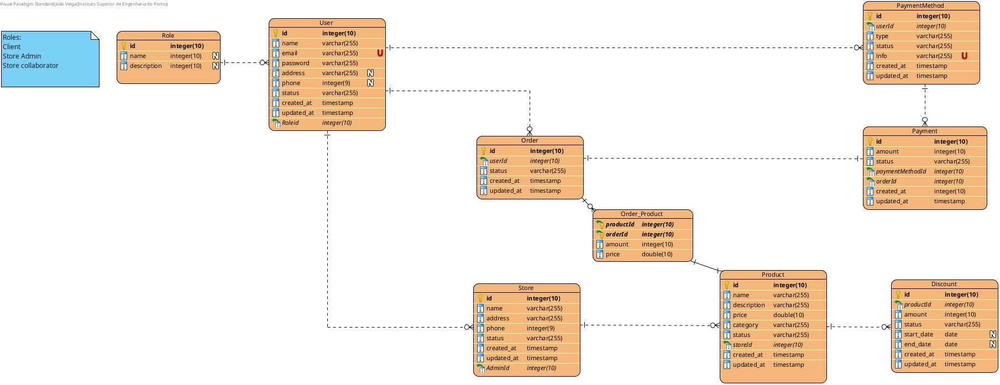
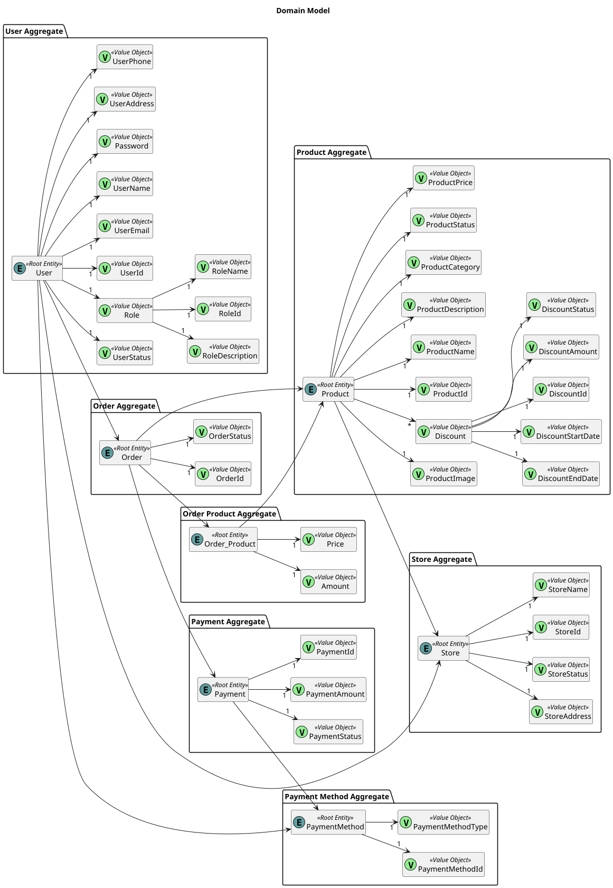

# Fase 1

## Logic Diagram

## Domain Model

## Requirements

This section lists the main functional and non-functional requirements for the system/application.

## Use Case
This section lists the Use Cases and the Use Case Diagram for the system/application.

## Security

## Deployment Diagram

The server for the ShopTex will use Fedora 38 and for the requests it will use HTTPS.
The databases will HTTPS for the connections with the backend and it won't have open ports open to outside internet. This databases will use MySQL version 8.0.

## Other

In this folder you can find also the Thread Model in the TM.json file for the Threat Dragon tool and the report in the threat_model_report.pdf file.
You can also find the ASVS (Application Security Verification Standard) checklist in the excel file.
